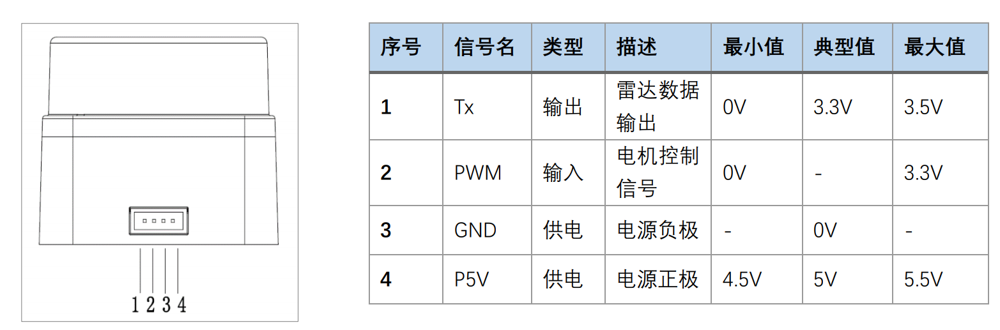

# PC_ROS_SDK使用说明（LD19）

---

> `PC_ROS_SDK`文件夹中包含的SDK适合应用于没有原生串口外设的平台，比如PC，需要使用CP2102等USB转串口芯片来连接LD19雷达与开发平台。
>
> **注意**：请确保自己的雷达是通过**CP2102**芯片的转接线与开发设备相连，其他型号的芯片并不能直接使用。

## 概述

此SDK并不是只能在PC上使用，对于任何通过USB转串口芯片连接的开发平台，此SDK都是适合的。比如使用树莓派的USB接口来连接雷达时就需要选用此版本。

在`PC_ROS_SDK`目录包含以下内容：

``` 
/doc/
/rviz/
/src/
/README_cn.md
/README_en.md
```

- `src`包含SDK源码

- `doc`下是中英文[**开发手册**](./doc/LDROBOT_LD06_开发手册_v1.0.pdf)（LD19与LD06手册通用，名称有差异）

- `rviz`的内容是使用rviz进行雷达数据的可视化

本SDK使用Ubuntu18.04下的Melodic，16.04下的Kinetic以及搭载Noetic和Ubuntu20.04 Server的树莓派3B+下测试通过。

## 使用方法

### 硬件准备

> LDRobot LD19激光雷达、CP2102串口转USB线缆

按照下图（见开发手册“通讯接口”一节）连接线缆与雷达：



LD19采用ZH1.5T-4P 1.5mm接口。其中PWM信号**可以悬空不接**，此时雷达将以默认转速运行。

最后，将CP2102插入上位机USB口，并确保正确识别了它。

### 软件准备

此SDK需要上位机安装好ROS，推荐使用Ubuntu18.04、16.04，ROS：Melodic、Kinetic。

整个过程可以使用普通用户来操作，无需以root身份登入。但要确保所使用的用户拥有对应串口的读写权限。

设置权限参见开发手册[第五章第一节：设置权限](./doc/LDROBOT_LD06_开发手册_v1.0.pdf)

至此，软硬件准备完毕。

### 使用流程

1. 将文件夹`PC_ROS_SDK/src`与`PC_ROS_SDK/rviz`复制保存在某空白目录A下。
2. 在目录A下打开终端，运行`catkin_make`命令进行编译。
3. 在编译成功后运行`source ./devel/setup.bash`添加环境变量。
4. 调用命令`roslaunch ldlidar ld19.launch`运行SDK，如果显示successfully则成功。
5. 开启成功后需要保持程序运行才能在ROS里使用雷达，`Ctrl+C`或者关闭终端将中止程序。

**注意：**

在每次打开新的终端时，都需要先按照第三条添加环境变量才能进行第四条。如果希望省略第三步，可以将相应命令添加到`~/.bashrc`文件中。

在运行SDK后如果连接不到雷达，则会输出`open error`字样。

如果希望关闭终端后依然运行，可以配合`nohup`命令使之后台运行。

## 使用实例

一个使用rviz将雷达数据实时可视化的例子，请参阅[开发手册第五章](./doc/LDROBOT_LD06_开发手册_v1.0.pdf)。

