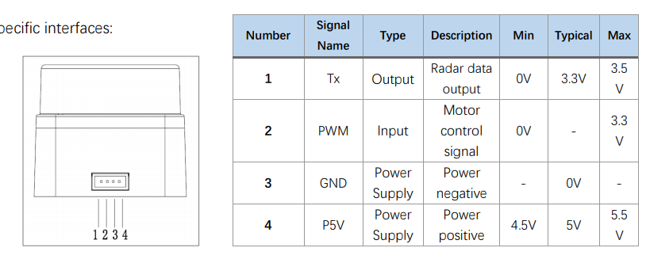

# PC_ROS_SDK Direction Of Use(LD19)

---

> Directory `PC_ROS_SDK` contains the SDK that is suitable for the platform without native serial peripheral, such as PC, it requires an extra CP2102 USB to UART bridge to connect LD19 and the upper platform.
>
> **Notice**: Make sure that the USB to UART chip you use is **CP2102**, other chips of the same function CAN NOT be recognized by the SDK without any modification.

## General Description

This SDK could be used on any platform that is connected to LD19 through CP2102, not confined to PC.

The contents of directory `PC_ROS_SDK` are listed below:

```
/doc/
/rviz/
/src/
/README_cn.md
/README_en.md
```

+ `src` contains the source code of SDK
+ `doc` contains the user manual in English and Chinese (LD19 shares the same documents with LD06, pls be awarded)
+ `rviz` contains the file which is used to configure the visualization of radar data

This SDK has been tested in Ubuntu 18.04 with Melodic, Ubuntu 16.04 with  Kinetic on PC and Noetic in Ubuntu 20.04 Server on Raspberry Pi3B+.

## Usage

### Hardware Preparation

> LDRobot LD19 radar, CP2102 USB to UART Bridge

Link LD19 to the upper computer according to the diagram below(could be found in the section Communication Interface of [user manual](./doc/LDROBOT_LD06_Development_manual_v1.0_en.pdf)):



LD19 adopt ZH1.5T-4P 1.5mm connector. The PWM signal, namely the second pin, need not to be attached to certain GPIO if you're not going to control the revolving speed.

Then plug the CP2102 to the USB port of upper computer, check if it's recognized.

### Software Preparation

The SDK requires installed ROS, Ubuntu:18.04、16.04，ROS: Melodic、Kinetic are recommended.

The whole process could be conducted with a normal user's account, however, the **authority of using the ttyUSB device is a necessity**.

For setting the access please refer to the [User Manual Section 5.1: Set Access](./doc/LDROBOT_LD06_Development_manual_v1.0_en.pdf)

So far, all the preparation is done.

### Procedure Of Use

1. Copy folder `PC_ROS_SDK/src` and `PC_ROS_SDK/rviz` to certain empty directory A.
2. Open a terminal in A, run `catkin_make` to compile the SDK.
3. If the target has been built, run `source ./devel/setup.bash` to add some environmental variables.
4. Call `roslaunch ldlidar ld19.alaunch` at any directory to run the SDK, if there's a `Successfully` in the end of output, the LD19 has been found.
5.  Keep the terminal open, the SDK should be kept running when other ROS packets 

**Notice**

Every time you open a terminal, step 3 should be performed before step 4. There's a way to simplify it, add `source ./devel/setup.bash` to `~/.bashrc`, then you can ignore step 3 every time start a new terminal.

If the SDK can't find the radar, it will print `open error`, but it won't exit.

You can make use of `nohup` to let the SDK runs in the background.

## Example

An example of using rviz to visualize real time data from LD19 is in the [chapter 5 of User Manual](./doc/LDROBOT_LD06_Development_manual_v1.0_en.pdf).

