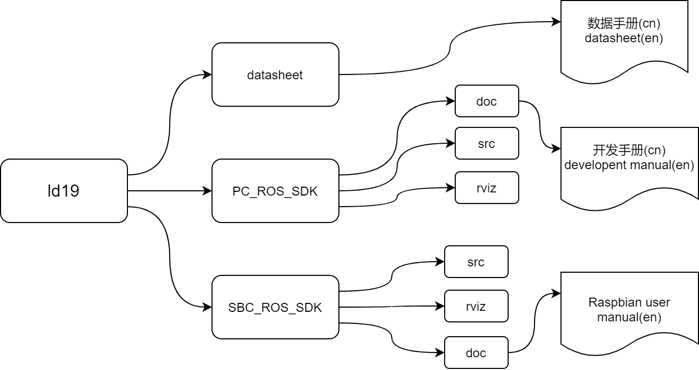

# LD19 DTOF ROS_SDK

---

> 本项目是激光TOF雷达LD19的开发SDK。
>
> 基于ROS，此SDK让LD19雷达可以在多平台（PC、SBC）下进行开发。
>
> [English Version Here](https://github.com/HuXioAn/ld19#english-version)

# 概述

项目主体结构如图：

`datasheet`目录下为中英文LD19雷达数据手册，描述其硬件参数。

`PC_ROS_SDK`和`SBC_ROS_SDK`目录分别存放着SDK的两个版本，使用者需要根据情况来**选择其中一个**使用。两个目录下分别有中英文README进行更详细的说明。

链接在此：[PC_README](./PC_ROS_SDK/README_cn.md)、[SBC_README](./SBC_ROS_SDK/README_cn.md)

## PC与SBC版本的区别

使用PC与SBC(Single Board Computer)进行两个版本的划分实际上只是体现一种**代表性**。

两个版本的区别在于其寻找雷达设备时，PC版会去寻找`CP2102`转换芯片的USB串口，SBC则会直接调用设备上的串口外设。因为绝大部分电脑已经不配备串口，连接雷达时需要使用转换芯片（CP2102）。而单板计算机，以树莓派为例，它们具有原生串口外设，不需要转换芯片。

举个例子，如果要在树莓派的USB口上外接ld19雷达，那么需要选择`PC_ROS_SDK`。

如果选择了不合适的版本，编译并不会出现任何错误，但是运行时就无法找到雷达。

## 使用流程

1. 根据开发平台，结合前文所述确定使用的版本。
2. 进入所选版本对应的文件夹，查看`README`获取更详细的步骤。[PC_README](./PC_ROS_SDK/README_cn.md)、[SBC_README](./SBC_ROS_SDK/README_cn.md)

## 注意！

由于LD19雷达与LD06雷达基本一致，SDK内部分手册为LD06手册，请注意需要改变内容的地方。

----

## English Version:

> This repositorise contains the SDK for LD19 DTOF radar.
>
> Basing on ROS, the SDK allows the development of LD19 on different platform(PC, SBC).

## General discription

The file structure of this repositories is shown in the graph below:

You could find three directories: `datasheet`, `PC_ROS_SDK`, `SBC_ROS_SDK`.

In the `datasheet`, there're datasheet files of the radar LD19 in both English and Chinese.

The two versions of SDK are separately stored in `PC_ROS_SDK`and `SBC_ROS_SDK`, you have to **choose one version from the two** accroding to the next section. What's more, the detailed instructions are also in the two directories.

 Links are here:[PC_README](./PC_ROS_SDK/README_en.md),[SBC_README](./SBC_ROS_SDK/README_en.md)

## Difference betweent PC and SBC versions

**Please read this section with carefulness, the version of your choice could be decisive to the whole process.**

We use names "PC" and "SBC(Single Board Computer)" to indicate the features of the two versions, for the PC version was programmed to search the `CP2102` device, the functions of which are converting the UART signal to USB and simulating a virtual COM, while the SBC version will directly use the serial on the board.

Owing to the fact that most of PC do not have any Serial port, extra hardware(CP2102) is needed. On the contrary, SBCs like Raspberry Pi are equipped with Serial peripheral,  radar can be linked to the board through GPIOs.

For example, if you are going to connect your radar and Raspberry Pi through the USB port, then you need to use PC version rather than SBC version. 

If a inappropriate SDK is put into use, there won't be any abnormity but it just can't find the radar.

## Usage

1. Read the section above then choose the proper version for your hardware.
2. Please turn to the README contained in the directory of the version you chose for further instructions in detail.[PC_README](./PC_ROS_SDK/README_en.md),[SBC_README](./SBC_ROS_SDK/README_en.md)

## Notice

LD19 is basically the same as LD06 in all aspects, so some manual books are based on LD06, please be aware of the contents that need modifying.

