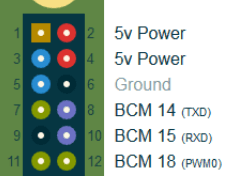

# SBC_ROS_SDK使用说明（LD19）

> `SBC_ROS_SDK`文件夹中包含的SDK版本适合应用于带有**原生串口外设**的平台，比如树莓派，可以直接连接LD19雷达与开发平台，这也是此版本称作SBC版的原因。

## 概述

在`SBC_ROS_SDK`目录包含以下内容：

``` 
/doc/
/rviz/
/src/
/README_cn.md
/README_en.md
```

- `src`包含SDK源码

- `doc`下是Raspbian_ROS[开发手册](./doc/LDRobot_LD19_Raspbian_User_manual_V2.3.pdf)（LD19与LD06手册通用，名称有差异）

- `rviz`的内容是使用rviz进行雷达数据的可视化

本SDK使用搭载Kinetic和Raspbian 9以及Noetic和Ubuntu20.04 Server的树莓派3B+上测试通过。

## 使用方法

### 硬件准备

> LDRobot LD19激光雷达、连接线

按照下图（见开发手册“通讯接口”一节）连接GPIO与雷达：


LD19采用ZH1.5T-4P 1.5mm接口。其中PWM信号**可以悬空不接**，此时雷达将以默认转速运行。

将供电与地连接到SBC的5V与GND，将雷达的TX线连接到SBC串口的RX引脚上，这里以树莓派3B+为例：



> 1(Tx)------------->10(RXD)
>
> 2(PWM)---------悬空
>
> 3(GND)--------->6(GND)
>
> 4(P5V)---------->(5V Power)

### 软件准备

此SDK需要上位机安装好ROS，由于种种原因，在SBC上安装ROS会遇到比较多的困难，可以考虑使用Ubuntu系统，或者直接使用他人编译的已经安装ROS的系统镜像。开发手册内描述的ROS安装方法为下载源码本地编译，需要较好的网络条件。

树莓派需要在系统配置页面使能串口，不然将不会在`/dev/`下看到对应的tty设备。具体操作参见`doc`目录下使用手册第四章：[START SERIAL ttyS0](./doc/LDRobot_LD19_Raspbian_User_manual_V2.3.pdf)。

开发手册中提到的`WiringPi`与`udev`库并不是必须的，可以跳过安装。

接下来的过程可以使用普通用户来操作，无需以root身份登入。但要确保所使用的用户拥有对应串口的**读写权限**。

至此，软硬件准备完毕。

### 使用流程

1. 将文件夹`SBC_ROS_SDK/src`与`SBC_ROS_SDK/rviz`复制保存在某空白目录A下。
2. 在目录A下打开终端，运行`catkin_make`命令进行编译。
3. 在编译成功后运行`source ./devel/setup.bash`添加环境变量。
4. 调用命令`roslaunch ldlidar ld19.launch`运行SDK，如果显示successfully则成功。
5. 开启成功后需要保持程序运行才能在ROS里使用雷达，`Ctrl+C`或者关闭终端将中止程序。

**注意：**

在每次打开新的终端时，都需要先按照第三条添加环境变量才能进行第四条。如果希望省略第三步，可以将相应命令添加到`~/.bashrc`文件中。

在运行SDK后如果连接不到雷达，则会输出`open error`字样。

如果希望关闭终端后依然运行，可以配合`nohup`命令使之后台运行。

## 使用实例

一个使用rviz将雷达数据实时可视化的例子，请参阅[开发手册第五章](./doc/LDRobot_LD19_Raspbian_User_manual_V2.3.pdf)。

